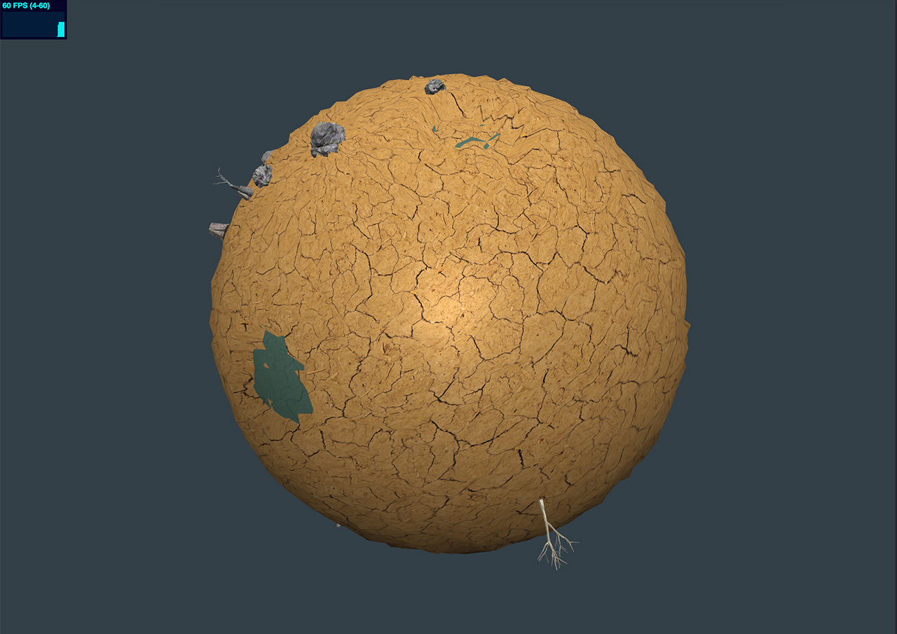
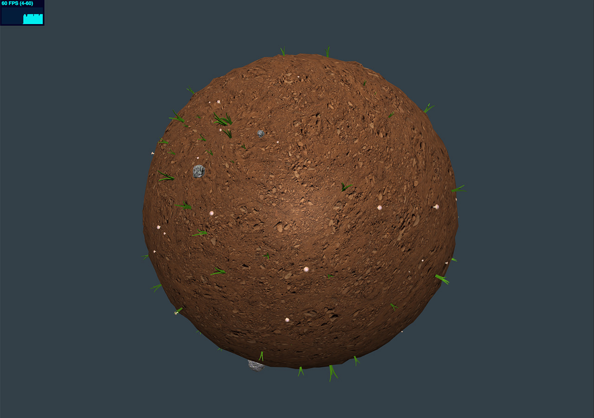
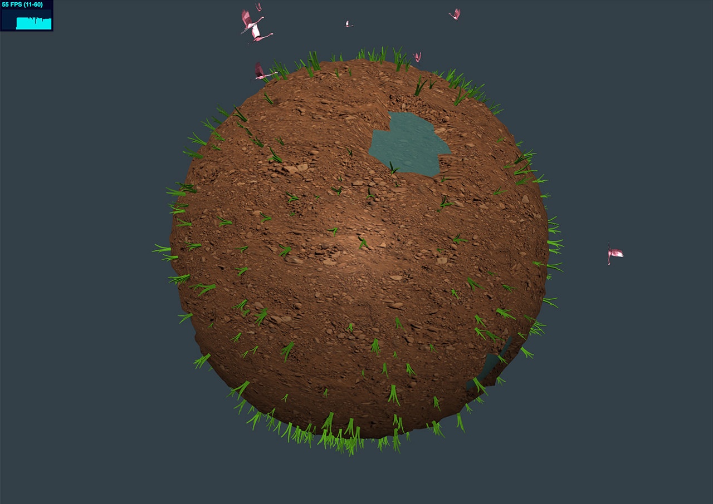

# FHP - Expression Mirror Project
WebGl (threejs) based evolution simulation by tracked face expression detections

## Take a look
[Online Demo](http://projects.coderwelsch.com/fhp/io-expression-mirror/)  

There are currently just some states implemented, but more will coming soon (and pink flamingos, of course, too)!

### Different States:  
State 1: Death Valley

State 2:

State 3:

