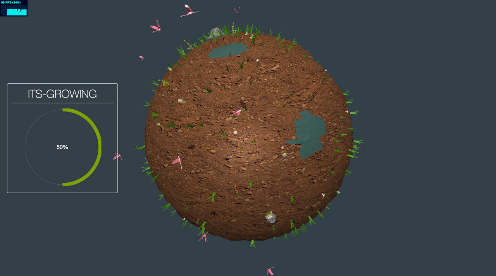

# FHP - Expression Mirror Project
WebGl (threejs) based evolution simulation by using face expression tracking data

## Take a look
[Online Demo](http://projects.coderwelsch.com/fhp/io-expression-mirror/)  

There are currently just some states implemented, but more will coming soon (and pink flamingos, of course, too)!

### Different States:  
State 1: Death Valley

State 2: Fertile

State 3: Flamingos Ahoi!

## Latest Changes
### 2017-04-17: Added skeletons in state 1 and progress circle:

